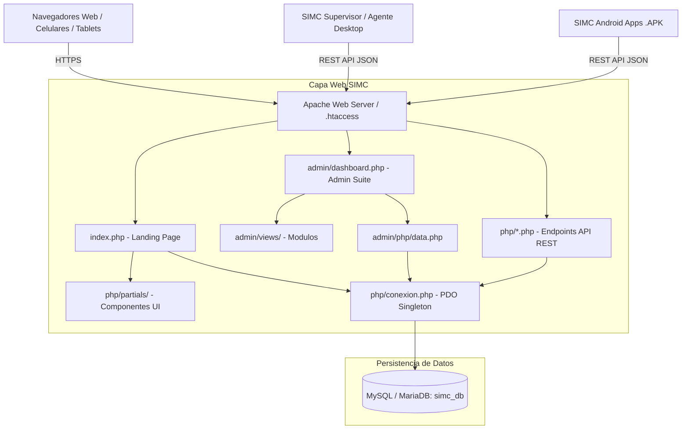

# 🌐 SIMC — Plataforma Web Oficial y Portal Ecosistema

<div align="center">

[](https://www.php.net/)
[](https://www.mysql.com/)
[](https://developer.mozilla.org/es/docs/Web/JavaScript)
[](#-distribución-de-aplicaciones-móviles)
[](LICENSE)
[](#)

<br>

**Portal Central Oficial, Pasarela de Licenciamiento, Centro de Descargas y Panel Administrativo RBAC**

<br>

[Características](#-características-principales) •
[Ecosistema](#-ecosistema-simc-módulos-relacionados) •
[Arquitectura](#-arquitectura-del-sistema) •
[Estructura](#-estructura-del-repositorio) •
[Instalación](#-guía-de-instalación-y-despliegue) •
[Endpoints API](#-apis-rest-para-el-ecosistema) •
[Descargas APK](#-distribución-de-aplicaciones-móviles)

</div>

---

## 📌 Descripción General

El repositorio **`SIMC_Web`** constituye el nodo maestro y portal institucional del ecosistema **SIMC** (*Sistema Inteligente de Monitoreo de Concentración y Control de Aulas*).

Esta plataforma centraliza:
1. **Landing Page Comercial & Tecnológica:** Presentación del producto, especificaciones de la Inteligencia Artificial (YOLOv8, MediaPipe), catálogo de planes y demostración interactiva con partículas en canvas.
2. **Pasarela de Pagos y Licenciamiento:** Emisión determinística de códigos de licencia de membresía (`SIMC-PLAN-XXXX-YYYY`) calculados con hash criptográfico SHA-256.
3. **Centro Oficial de Descargas:** Repositorio y distribución de las aplicaciones móviles Android (`.APK`) y de escritorio Windows (`.EXE`).
4. **API REST de Autenticación:** Endpoints JSON de alta seguridad consumidos por las apps de escritorio y móviles (`SIMC Supervisor` y `SIMC Agente`) para verificar cuentas y cupos en tiempo real.
5. **SIMC Admin Suite (Panel de Control):** Dashboard administrativo protegido por control de acceso basado en roles (RBAC) con métricas en vivo, gestión de incidentes, usuarios y exportación de datos.

---

## 🌐 Ecosistema SIMC (Módulos Relacionados)

El proyecto **SIMC** está diseñado bajo una arquitectura modular y distribuida, dividida en los siguientes componentes:

| Módulo | Repositorio / Ubicación | Stack Tecnológico | Rol en el Ecosistema |
| :--- | :--- | :--- | :--- |
| **SIMC Web** *(Este repo)* | [Jheysmar-Mendieta/SIMC_Web](https://github.com/Jheysmar-Mendieta/SIMC_Web) | PHP 8, MySQL, Vanilla JS, CSS3 | Portal institucional, emisión de licencias, landing page, APIs y panel administrativo. |
| **SIMC PRO** | [Jheysmar-Mendieta/SIMC_PRO](https://github.com/Jheysmar-Mendieta/SIMC_PRO) | Python, Flask, Socket.IO, YOLOv8 | Servidor de aula en tiempo real, streaming WebRTC, bloqueo de terminales e IA de visión. |
| **SIMC Mobile (Android)** | Proyecto Android Studio (`MyApplication`) | Kotlin, WebView nativo, Android SDK | Aplicaciones móviles (.APK) para docentes (Supervisor), alumnos (Agente) y modo de estudio (Individual). |

---

## 🚀 Características Principales

- **Frontend Futurista & Reactivo:** Desarrollado en CSS3 Modular y Vanilla JavaScript ES6+, con estética Cyberpunk/Dark Glassmorphism, animaciones en Canvas y micro-interacciones sin dependencias pesadas.
- **Seguridad Robusta:**
  - Inyecciones SQL neutralizadas al 100% mediante **PDO con Prepared Statements**.
  - Passwords cifrados con **Bcrypt (cost factor 12)**.
  - Rate Limiting y bloqueo contra ataques de fuerza bruta en inicio de sesión.
  - Protección XSS y CSRF integral en formularios y respuestas JSON.
- **Centro de Descargas Multi-Plataforma:**
  - Soporte para **Android APKs** (Supervisor, Agente e Individual).
  - Enlaces dinámicos con prevención de caché (`?v=timestamp`).
- **SIMC Admin Suite Integral:**
  - Tarjetas KPI en tiempo real (Usuarios, Consultas Pendientes, Licencias Activas, Ingresos).
  - Módulos tabulares con filtros en vivo y ordenamiento dinámico.
  - Generación de reportes y exportación en un clic a CSV.
  - Registro cronológico de auditoría (`sesiones_log`).

---

## 📐 Arquitectura del Sistema



---

## 📁 Estructura del Repositorio

```text
SIMC_Web/
├── .env.example              # Plantilla de variables de entorno para producción
├── .gitignore                # Reglas de exclusión de seguridad y ejecutables
├── .htaccess                 # Directivas Apache, mod_rewrite y compresión Gzip
├── LICENSE                   # Licencia de código abierto MIT
├── index.php                 # Enrutador y renderizador del Portal Oficial
├── admin/                    # SIMC Admin Suite (Panel Administrativo)
│   ├── dashboard.php         # Controlador principal del panel
│   ├── css/                  # Hojas de estilo del dashboard
│   ├── js/                   # Lógica reactiva del administrador
│   ├── php/                  # Controladores de datos (actions, data, exports)
│   └── views/                # Vistas modulares (consultas, usuarios, auditoría)
├── css/                      # Estilos modulares organizados por componentes
│   ├── animations.css        # Keyframes y transiciones fluidas
│   ├── components.css        # Botones, tarjetas, modales y pills
│   ├── hero.css              # Sección de impacto visual
│   ├── layout.css            # Grillas responsivas y contenedores
│   ├── reset.css             # Normalización CSS
│   ├── variables.css         # Paleta de color (#00F2FE, #030712) y tipografías
│   └── views.css             # Estilos de vistas dinámicas
├── database/
│   └── simc_db.sql           # Script SQL completo de estructura y datos iniciales
├── descargas/                # Centro oficial de distribución de software
│   └── apk/                  # Aplicaciones móviles Android (.APK)
│       ├── SIMC_Supervisor.apk
│       ├── SIMC_Agente.apk
│       └── SIMC_Individual.apk
├── js/                       # Módulos JavaScript Vanilla (ES6+)
│   ├── canvas.js             # Renderizado de partículas de fondo
│   ├── checkout.js           # Validación y pasarela de compra de licencias
│   ├── contact.js            # Enrutamiento de tickets de contacto
│   └── main.js               # Control de modales, menús y scroll reveal
├── pages/                    # Páginas institucionales complementarias
│   ├── cookies.php           # Política de cookies
│   ├── privacidad.php        # Términos legales y política de privacidad
│   └── terminos.php          # Condiciones de servicio
└── php/                      # Backend funcional y endpoints REST
    ├── conexion.php          # Conexión PDO Singleton + Clases de Seguridad
    ├── api_auth.php          # Endpoint REST de validación para apps
    ├── procesar_pago.php     # Generador criptográfico de licencias
    ├── login.php / logout.php# Manejo de sesiones seguras
    └── partials/             # Componentes HTML renderizables por index.php
```

---

## 🛠️ Guía de Instalación y Despliegue

### 1. Requisitos del Servidor
- **Servidor Web:** Apache 2.4+ (con módulos `mod_rewrite` y `mod_headers` activos).
- **PHP:** Versión 8.0 o superior (extensiones: `pdo_mysql`, `openssl`, `json`, `mbstring`).
- **Base de Datos:** MySQL 8.0+ o MariaDB 10.4+ (Compatible con XAMPP, LAMP y Docker).

### 2. Pasos de Instalación (Entorno Local XAMPP)

1. **Clonar el repositorio:**
   ```bash
   cd c:/xampp/htdocs/
   git clone https://github.com/Jheysmar-Mendieta/SIMC_Web.git
   ```

2. **Configurar la Base de Datos:**
   - Abre **phpMyAdmin** (`http://localhost/phpmyadmin/`).
   - Crea una base de datos llamada `simc_db` con cotejamiento `utf8mb4_unicode_ci`.
   - Importa el archivo [`database/simc_db.sql`](database/simc_db.sql).

3. **Configurar Variables de Entorno:**
   - Copia `.env.example` como `.env`:
     ```bash
     cp .env.example .env
     ```
   - Modifica los parámetros de conexión si tu entorno local o de producción lo requiere:
     ```env
     DB_HOST=localhost
     DB_PORT=3306
     DB_NAME=simc_db
     DB_USER=root
     DB_PASS=
     ```

4. **Acceder a la Plataforma:**
   - **Portal Público:** `http://localhost/SIMC_Web/`
   - **Panel Administrativo:** `http://localhost/SIMC_Web/admin/`

---

## 🔌 APIs REST para el Ecosistema

### 1. Validación de Membresías y Login (`POST /php/api_auth.php`)
Consumido directamente por las aplicaciones de escritorio y móviles para verificar el plan del docente:
```json
// Request
{
  "action": "login",
  "usuario": "docente_demo",
  "password": "miPassword123"
}

// Response (200 OK)
{
  "success": true,
  "mensaje": "Autenticación exitosa",
  "usuario": {
    "id": 1,
    "username": "docente_demo",
    "nombre": "Prof. Carlos Méndez",
    "plan_activo": "ENTERPRISE",
    "limite_pcs": 50,
    "token_licencia": "SIMC-ENTERPRISE-A8F2-99C1"
  }
}
```

### 2. Emisión de Licencia (`POST /php/procesar_pago.php`)
Genera un token determinístico e intransferible tras procesar la suscripción:
$$\text{Token} = \text{SIMC} - \text{PLAN} - \text{HASH}_{1..4} - \text{HASH}_{5..8}$$

---

## 📱 Distribución de Aplicaciones Móviles

El sistema almacena y entrega las compilaciones oficiales para Android en `descargas/apk/`:

| Aplicación | Público Objetivo | Capacidades |
| :--- | :--- | :--- |
| **SIMC Supervisor (.apk)** | Docentes / Administradores | Creación de aulas en vivo, visualización en cuadrícula de pantallas, control de bloqueo e intercomunicador por voz. |
| **SIMC Agente (.apk)** | Alumnos | Monitoreo en segundo plano, enlace por token de aula, detección de distracciones. |
| **SIMC Individual (.apk)** | Estudiantes / Modo Solo | Técnicas de enfoque Pomodoro, bloqueo de distracciones y métricas personales. |

---

## 🔒 Licencia y Autoría

Distribuido bajo la **Licencia MIT**. Consulta el archivo [`LICENSE`](LICENSE) para más detalles.  
Desarrollado para el ecosistema **SIMC PRO** por **[Jheysmar Mendieta](https://github.com/Jheysmar-Mendieta)**.  
Todos los derechos reservados © 2026.
